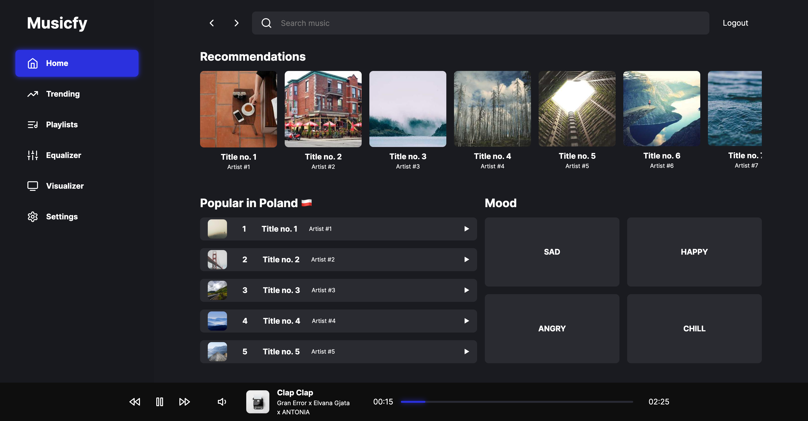

# Musicfy

A simple audio player app, allowing the play some demo songs, internet radio stations and use the Spotify music collection (not ready yet).

## Description

The app's purpose is to learn how to use the Browser WebAudio API to play and apply audio effects on it, ~~get knowledge about Spotify API~~, and ~~Canvas API to generate visualizations~~.

## Demo

A demo is available at [https://musicfy-omega.vercel.app/](https://musicfy-omega.vercel.app/).

## Screenshots

The screenshots are outdated, to see the current state, please visit the demo site.



## Web Audio API

The Web Audio API is a high-level JavaScript API for processing and synthesizing audio in web applications. This API aims to include capabilities found in modern game audio engines and some of the mixing, processing, and filtering tasks found in modern desktop audio production applications. The API is capable of dynamically positioning/spatializing multichannel sound sources in 3D space - generated GitHub Copilot, probably powered by Google and/or Wikipedia.

### Basics of the Web Audio API

The app's interface may suggest that using the Web Audio API is complicated, but it's not. The most basic (and working) way to start play with the audio in the browser is  to create a new Audio object, assign an audio source to it (through `URL`) and invoke the .play() method:

```javascript
const audio = new Audio();
audio.src = 'https://example.com/song.mp3';
audio.play();
```

### What can be the audio source?

Almost everything might be an audio source, such as a local file, a remote file, a stream, a microphone, etc. The only requirement is that the source must be a valid audio file.

### How it works in the Musicfy?

The heart of the app, like the same  it the advanced and professional tuners/amplifiers, is an audio processor. The audio processor is represented by invisible component (returning `null`) called `AudioProcessor`. It listens to the events in the Redux Store, and applies the changes to the audio object, manages the audio context, the audio nodes and effects. It also generating the values of frequency and time domain data, which are used to generate the visualizations.

Nevertheless, the most important line of code is the following:

```javascript
const setNewAudioUrlAndStartPlay = useCallback(
    (url: string) => {
      // (...)

      audio.current = new Audio(url); // <-- this line

      // (...)
    },[]
  );
```

### What is the audio context?

The audio context is the main object in the Web Audio API. It represents the audio-processing graph, which is built from audio sources, audio processors, and audio destinations. You can think about it as a virtual audio mixer, where you can connect the audio sources to the audio processors, and the audio processors to the audio destinations. The audio context is also responsible for managing the audio nodes and effects - GitHub Copilot again 😅.

### Audio spectrum analyzing


## Used technologies

- 🎁 Repository: Monorepo powered by NX
- 🧰 Frameworks: React, Redux Toolkit
- 🛠️ Tools: ~~yarn, eslint, prettier, husky, conventional commits, axios~~, react-router
- 🎨 Styling: styled ui by emotion, lucide icons
- 🧪 Testing: ~~cypress, jest~~
- ☁️ Data source: ~~Spotify API~~ hardcoded song
- 💎 Others: desktop-first approach, ~~progressive web app, atomic design~~

## How to start

1. Clone the repository.
2. Install node.js and yarn.
3. Install dependencies with `yarn install`.
4. Run the project with `yarn web`.
